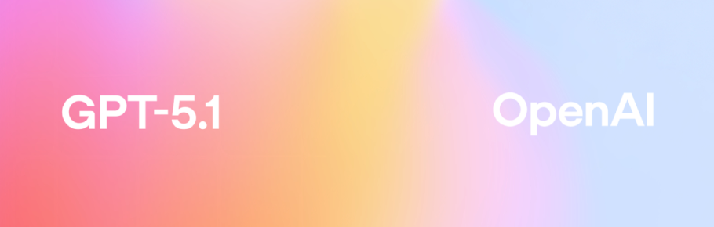

# GPT-5.1 Telegram Bot 🤖



Телеграм-бот для доступа к GPT-5.1 через OpenAI API с монетизацией через Telegram Stars.

## 🚀 Попробовать бота

**Ссылка на бота:** [@ChatGPTTlgrmBot](https://t.me/ChatGPTTlgrmBot)

## 💡 Идея проекта

Предоставить минимальный доступ к GPT-5.1 за символическую плату. **1 Telegram Star = 1 запрос** — это намного выгоднее, чем подписка на ChatGPT за $20/месяц!

## ✨ Преимущества

* 💰 **Выгодная цена**: 1⭐ за запрос вместо $20/месяц за подписку
* 🎁 **Бесплатный старт**: Первые 3 запроса бесплатно
* 💳 **Гибкая оплата**: Платите только за то, что используете
* 🔢 **Произвольные суммы**: Покупайте от 1 до 100 запросов за раз
* ⚡ **Быстрый доступ**: Без регистрации, прямо в Telegram
* 🆕 **Новейшая модель**: Доступ к GPT-5.1
* 📊 **Прозрачность**: Видите остаток запросов после каждого использования
* 🔓 **Open Source**: Исходный код доступен для всех

Используйте промокод **GITHUB2025**, чтобы получить ещё 3 бесплатных запроса — просто отправьте команду `/promo` боту.

## Команды

### Для пользователей

* **/start** — приветствие.
* **/help** — подробная инструкция по использованию бота.
* **/balance** — проверить остаток запросов.
* **/buy** — купить запросы через Telegram Stars.
* **/promo** — активировать промокод.
* **/dev** — информация о разработчике и проекте.

### Для администратора

* **/admin** — список команд для администрирования.
* **/stat** — статистика использования бота: пользователи, запросы, выручка.
* **/give** — начислить запросы пользователю по его ID.
* **/createpromo** — создать новый промокод.
* **/listpromo** — показать список всех активных промокодов.
* **/deletepromo** — удалить промокод.

## 🎯 Особенности

* **Произвольные суммы** — покупка от 1 до 100 запросов за раз.
* **Умные ответы** — генерация сообщений с GPT-5.1.
* **Индикатор "печатает..."** — видно, что бот обрабатывает запрос.
* **Валидация сообщений** — проверка длины текста (10–4000 символов).
* **SQLite база данных** — хранение информации о пользователях, запросах и платежах.
* **Telegram Stars** — встроенная система оплаты прямо в мессенджере.

## 📁 Структура проекта

```
chatgpt-telegram-bot/
├── bot.py           # Основной файл бота
├── functions.py     # Функции для работы с OpenAI API
├── db.py            # Управление базой данных
├── config.py        # Конфигурация и загрузка переменных окружения
├── .env             # Конфигурационные переменные (создать вручную)
├── .env.example     # Шаблон для .env
├── requirements.txt
└── README.md
```

## 📦 Установка

1. **Клонируйте репозиторий**
   ```bash
   git clone https://github.com/king-tri-ton/chatgpt-telegram-bot.git
   cd chatgpt-telegram-bot
   ```

2. **Установите зависимости**
   ```bash
   pip install -r requirements.txt
   ```

3. **Создайте файл .env**
   
   Скопируйте `.env.example` и переименуйте в `.env`:
   ```bash
   cp .env.example .env
   ```

4. **Заполните переменные окружения в .env**
   ```env
   AI_TOKEN=your_openai_api_token
   BOT_TOKEN=your_telegram_bot_token
   ADMIN_ID=your_telegram_user_id
   DB_NAME=your_db_name
   ```
   
   - **AI_TOKEN**: Получите на [platform.openai.com](https://platform.openai.com/api-keys)
   - **BOT_TOKEN**: Получите у [@BotFather](https://t.me/botfather) в Telegram
   - **ADMIN_ID**: Ваш Telegram ID (узнать можно у [@username_to_id_bot](https://t.me/username_to_id_bot))
   - **DB_NAME**: Название базы данных SQLite3

## 🚀 Запуск

```bash
python bot.py
```

## 📖 Использование

1. Найдите бота в Telegram: [@ChatGPTTlgrmBot](https://t.me/ChatGPTTlgrmBot)
2. Отправьте `/start` для начала работы (получите 3 бесплатных запроса)
3. Отправляйте сообщения (10-4000 символов) для получения ответов от GPT-5.1
4. Используйте `/balance` для проверки остатка запросов
5. Используйте `/buy` для покупки дополнительных запросов через Telegram Stars

## 💳 Система оплаты

Бот использует **Telegram Stars** для монетизации:

- 🎁 **3 бесплатных запроса** при регистрации
- ⭐ **1 Telegram Star = 1 запрос** к GPT-5.1
- 💰 Быстрые варианты: 1, 5, 10, 25, 50, 100 Stars
- ✏️ Произвольная сумма: от 1 до 100 запросов
- 📊 История платежей сохраняется в базе данных

## 🛠 Требования

- Python 3.7+
- Telegram аккаунт
- OpenAI API ключ с доступом к GPT-5.1
- Библиотеки из requirements.txt:
  - pyTelegramBotAPI (telebot)
  - openai
  - python-dotenv
  - sqlite3 (встроен в Python)

## 📄 Лицензия

Проект распространяется по лицензии [MIT](LICENSE).

## ⚠️ Отказ от ответственности

Используйте бота ответственно в соответствии с:
- Правилами использования Telegram
- Политикой использования OpenAI API
- Лимитами API обеих платформ

Разработчик не несет ответственности за:
- Содержание ответов, сгенерированных GPT-5.1
- Расходы на использование OpenAI API
- Использование бота третьими лицами

## 🌟 Поддержите проект

Если проект вам понравился:
- ⭐ Поставьте звезду на GitHub
- 📢 Поделитесь с друзьями
- 💬 Напишите отзыв

---

**Ссылка на бота:** [@ChatGPTTlgrmBot](https://t.me/ChatGPTTlgrmBot)

По всем вопросам: [@king_triton](https://t.me/king_triton) или [@lizamngr](https://t.me/lizamngr)